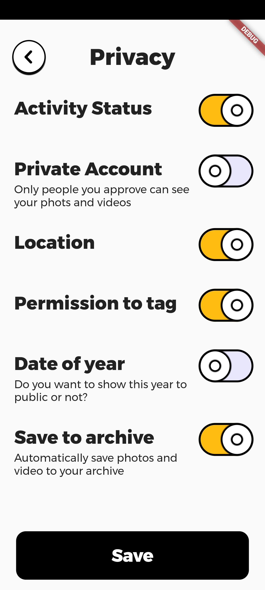

# summertask2020

Monday Morning - App Team Summer Task 2020
[Link To .apk File](https://github.com/rutajdash/MondayMorning_SummerTask2020/blob/master/app.apk)

## Screenshot 1

## Screenshot 2

## Getting Started

This project is a starting point for a Flutter application.

A few resources to get you started if this is your first Flutter project:

-   [Lab: Write your first Flutter app](https://flutter.dev/docs/get-started/codelab)
-   [Cookbook: Useful Flutter samples](https://flutter.dev/docs/cookbook)

For help getting started with Flutter, view our
[online documentation](https://flutter.dev/docs), which offers tutorials,
samples, guidance on mobile development, and a full API reference.
